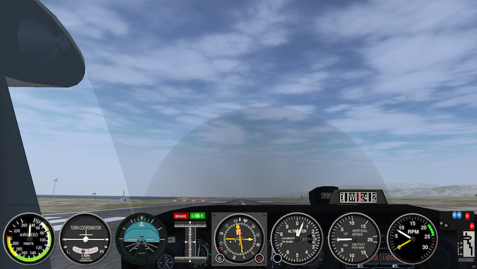

# 2D-Panel-example
 for FlightGear
 
##  Installation instructions
 
Move Panels/warty-mini-panel.xml
into
Aircraft/c172p/Panels/

Edit the panel section of

Aircraft/c172p/c172p-set.xml

to read, from line 64:

        <panel><!--path>Aircraft/c172p/Panels/c172-610x-panel.xml</path-->
            <path>Aircraft/c172p/Panels/warty-mini-panel.xml</path>
            <hide-nonzero-heading-offset>false</hide-nonzero-heading-offset>
            <visibility>false</visibility>
        </panel>
        
        
  When the sim starts, press shift-P to get:      
  